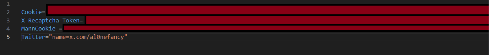

# Auto join cs2 giveaway

Auto join items giveaways on Steam. Currently available for sites: [Skinsmonkey](https://skinsmonkey.com/free-csgo-skins), [MannCo](https://mannco.store/)

## Requisites

Makefile

Python 3.8 or later versions

Run command to install required Python libraries

`pip install -r requirements.txt`

## Usage

Login to your giveaway sites. Use Inspector->Network to get your cookies. Create a **.env** file in the same folder, fill in as the image below, Twitter token is to join with your twitter url.

Run with admin privilege

`
    make
`

or

`make + [giveaways command]` in **Makefile**

## Notes

`timezone` in **Makefile** is to sync your system time settings for Windows
